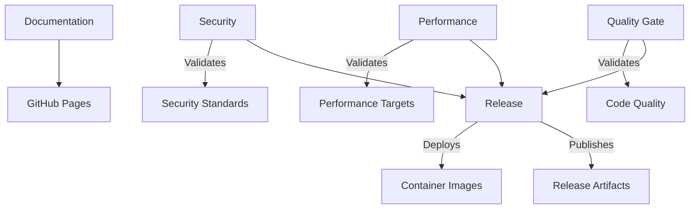

# MemoryStreamer CI/CD Pipeline

This directory contains the comprehensive GitHub Actions CI/CD pipeline for MemoryStreamer, designed to enforce zero-tolerance quality standards while supporting ultra-high-performance development requirements.

## Pipeline Overview

The CI/CD system consists of five specialized workflows that work together to ensure code quality, security, performance, and reliable deployments:

### 🛡️ Quality Gate Pipeline (`quality-gate.yml`)
**Triggers**: Every push/PR, nightly security scans  
**Purpose**: Primary quality enforcement with zero-tolerance standards

**Key Features**:
- Fast feedback checks (formatting, compilation, basic lints)
- Comprehensive quality matrix (multiple Rust versions, feature combinations, platforms)
- Extensive testing pipeline (unit, integration, property-based, coverage)
- Performance validation (10M+ msg/sec, <10μs latency)
- Security scanning integration
- Aggregate quality gate enforcement

**Zero-Tolerance Enforcement**:
- `cargo check --workspace` - Zero warnings required
- `cargo clippy --workspace -- -D warnings` - Zero violations required
- `cargo fmt --all --check` - Perfect formatting required
- `cargo test --workspace` - All tests must pass
- `cargo audit` - Zero vulnerabilities required
- 95%+ test coverage requirement

### ⚡ Performance Pipeline (`performance.yml`)
**Triggers**: Nightly, main branch pushes, performance-labeled PRs  
**Purpose**: Dedicated performance benchmarking and regression detection

**Key Features**:
- Optimized performance testing environment (CPU scaling, memory tuning)
- Latency benchmarks (protocol, round-trip, serialization)
- Throughput benchmarks (single/multi-threaded, publisher/consumer)
- Memory benchmarks (allocation patterns, leak detection, peak usage)
- Network benchmarks (TCP/UDP/QUIC performance)
- Stress testing (endurance, high-load, memory pressure)
- Automated regression analysis with threshold detection

**Performance Targets**:
- Latency: <10μs P99 end-to-end
- Throughput: >10M messages/second
- Memory: <1GB peak usage
- Zero memory leaks

### 🔒 Security Pipeline (`security.yml`)
**Triggers**: Weekly, push/PR with security-sensitive changes  
**Purpose**: Comprehensive security scanning and vulnerability detection

**Key Features**:
- Dependency vulnerability scanning with severity-based blocking
- Supply chain security (license compliance, typosquatting detection)
- Unsafe code analysis with zero-tolerance for project code
- Static analysis security testing (security-focused clippy lints)
- Hardcoded secret detection and security pattern analysis
- Optional fuzz testing for vulnerability discovery

**Security Standards**:
- Zero critical or high vulnerabilities
- MIT/Apache-2.0 license compliance only
- No unsafe code in MemoryStreamer packages
- No hardcoded secrets or credentials
- Regular security monitoring and updates

### 🚀 Release Pipeline (`release.yml`)
**Triggers**: Version tags (v*.*.*), manual release dispatch  
**Purpose**: Automated release process with comprehensive validation

**Key Features**:
- Comprehensive pre-release validation (quality, performance, security)
- Multi-platform builds (Linux, macOS, Windows; x64, ARM64)
- Container image builds and publishing (ghcr.io)
- Performance validation against release targets
- Automated GitHub release creation with assets
- Crate publishing preparation (crates.io ready)
- Post-release tasks (version management, announcements)

**Release Artifacts**:
- Cross-platform binaries with checksums
- Multi-architecture container images
- Comprehensive release notes with performance metrics
- Automated changelog generation

### 📚 Documentation Pipeline (`docs.yml`)
**Triggers**: Push/PR with documentation changes  
**Purpose**: Automated documentation generation and deployment

**Key Features**:
- Documentation validation (formatting, completeness, code examples)
- API documentation generation (comprehensive Rust docs)
- Guide documentation (mdBook-based user/developer guides)
- Architecture diagram generation (Mermaid-based system diagrams)
- Automated GitHub Pages deployment
- Documentation quality reporting

**Documentation Types**:
- API reference with full feature coverage
- User guides (quick start, configuration, usage)
- Developer guides (building, contributing, testing)
- Performance guides (benchmarking, optimization)
- Architecture documentation with visual diagrams

## Workflow Dependencies



## Environment Configuration

### Global Environment Variables
```yaml
CARGO_TERM_COLOR: always
CARGO_INCREMENTAL: 0
RUST_BACKTRACE: 1
RUSTFLAGS: "-D warnings -C target-cpu=native"
```

### Performance Environment
```yaml
MALLOC_CONF: "background_thread:true,metadata_thp:auto,dirty_decay_ms:30000"
MEMORY_ALLOCATOR: "jemalloc"
```

### Security Environment
```yaml
CARGO_AUDIT_OPTIONS: "--deny warnings --deny unmaintained --deny unsound --deny yanked"
```

## Quality Standards

### Code Quality Requirements
- ✅ Zero compilation warnings across all targets and features
- ✅ Zero clippy violations (all, pedantic, nursery, cargo lints)
- ✅ Perfect code formatting (rustfmt compliance)
- ✅ 95%+ test coverage with comprehensive test suites
- ✅ Zero memory leaks and optimal memory usage

### Performance Requirements
- ⚡ 10M+ messages/second throughput
- ⚡ <10μs P99 end-to-end latency
- ⚡ <1GB peak memory usage
- ⚡ Zero-copy message processing
- ⚡ Consistent performance across platforms

### Security Requirements
- 🔒 Zero critical or high severity vulnerabilities
- 🔒 Compliant licensing (MIT/Apache-2.0 only)
- 🔒 No unsafe code in project packages
- 🔒 No hardcoded secrets or credentials
- 🔒 Regular security audits and monitoring

### Release Requirements
- 📦 Multi-platform binary builds
- 📦 Container image publishing
- 📦 Comprehensive release notes
- 📦 Performance validation
- 📦 Automated version management

## Caching Strategy

The pipelines use intelligent caching to optimize build times:

- **Rust Cache**: `Swatinem/rust-cache@v2` with job-specific keys
- **Docker Cache**: GitHub Actions cache for container builds
- **Dependency Cache**: Cargo registry and git dependencies
- **Artifact Cache**: Build artifacts for cross-job sharing

## Monitoring and Alerts

### Quality Gate Monitoring
- Build success/failure rates
- Test coverage trends
- Performance regression alerts
- Security vulnerability notifications

### Performance Monitoring
- Latency trend analysis
- Throughput regression detection
- Memory usage tracking
- Benchmark result storage

### Security Monitoring
- Vulnerability scan results
- Dependency update notifications
- License compliance tracking
- Unsafe code usage alerts

## Development Workflow

### For Contributors
1. **Local Development**: Ensure `cargo check`, `cargo clippy`, `cargo test` pass
2. **Commit Standards**: Follow conventional commit format
3. **PR Submission**: All quality gates must pass before merge
4. **Performance Impact**: Performance-impacting changes trigger benchmarks

### For Maintainers
1. **Release Process**: Tag with semantic version for automated release
2. **Security Updates**: Monitor weekly security scan results
3. **Performance Tracking**: Review nightly performance reports
4. **Documentation**: Keep guides updated with feature changes

## Troubleshooting

### Common Issues

#### Build Failures
- Check Rust version compatibility
- Verify all dependencies are up to date
- Ensure feature flags are correctly specified

#### Performance Regressions
- Review recent changes for performance impact
- Check system resource availability
- Validate benchmark environment configuration

#### Security Failures
- Update vulnerable dependencies immediately
- Review license compatibility for new dependencies
- Audit any new unsafe code usage

#### Documentation Failures
- Validate markdown syntax
- Check for broken links
- Ensure code examples compile

### Getting Help

- **Issues**: Report problems on GitHub Issues
- **Discussions**: Use GitHub Discussions for questions
- **Discord**: Join our community Discord server
- **Documentation**: Check the comprehensive docs site

## Future Enhancements

### Planned Improvements
- Integration testing with external services
- Cross-platform performance comparison
- Automated dependency updates
- Enhanced security scanning
- Performance trend visualization

### Integration Opportunities
- IDE integration for local quality checks
- Pre-commit hooks for faster feedback
- Slack/email notifications for critical failures
- Dashboard for quality metrics visualization

---

This CI/CD pipeline represents a production-ready, enterprise-grade solution for maintaining ultra-high-performance software with zero-tolerance quality standards. It supports MemoryStreamer's ambitious performance targets while ensuring security, reliability, and maintainability.